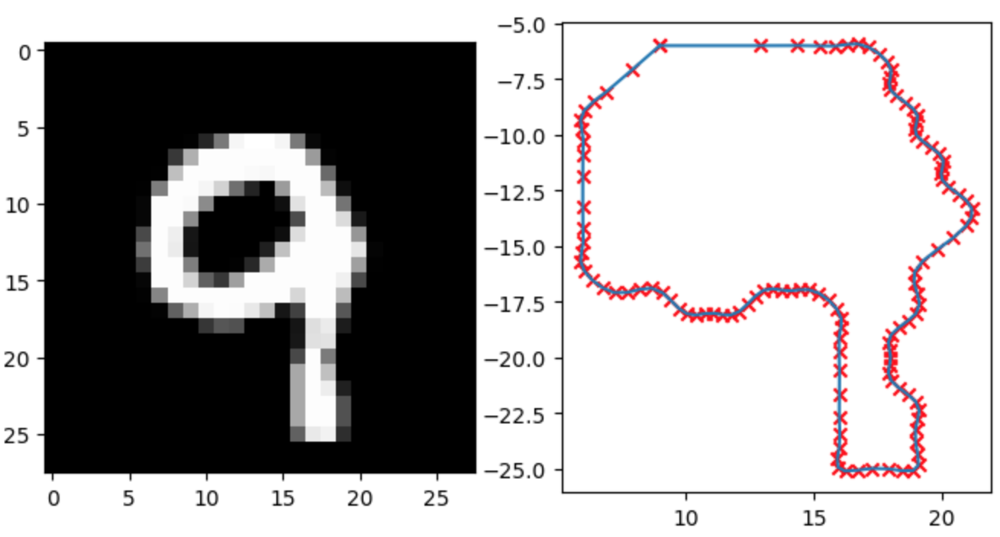

This code is indeed tailored for processing contours extracted from images, a common task in computer vision projects. 
It includes functions dedicated to tasks such as curve parameterization, contour extraction, and resampling with a specified number of points. 
The comments provided offer clear explanations of each function's purpose and contribute to understanding the code's overall flow.
This image serves to illustrate the code's functionality in contour extraction from images, a crucial aspect of computer vision tasks. 
